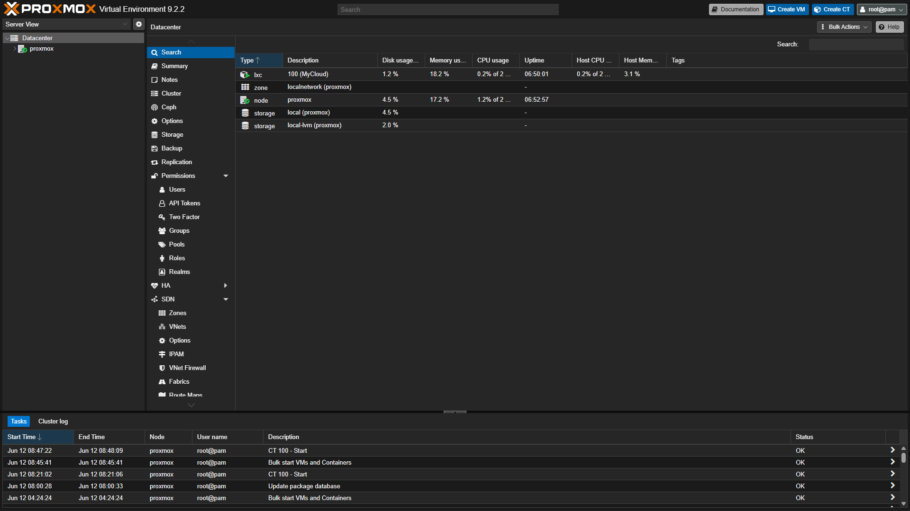
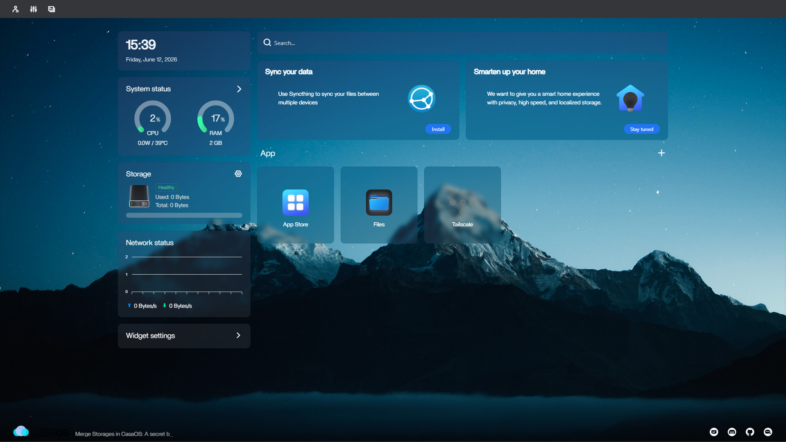
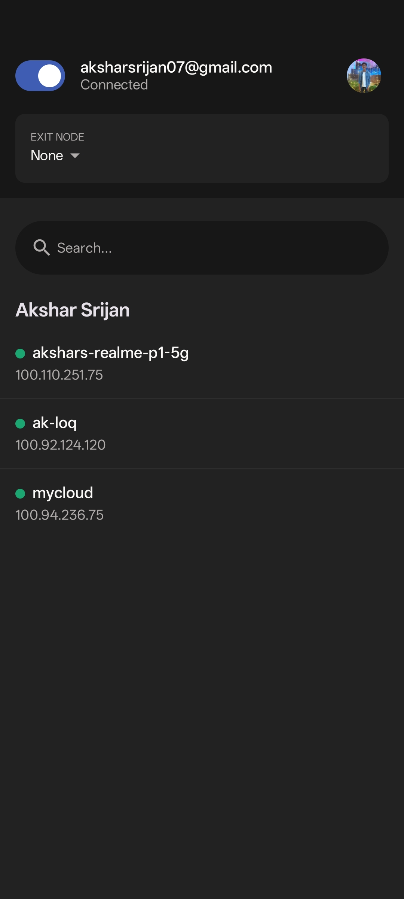
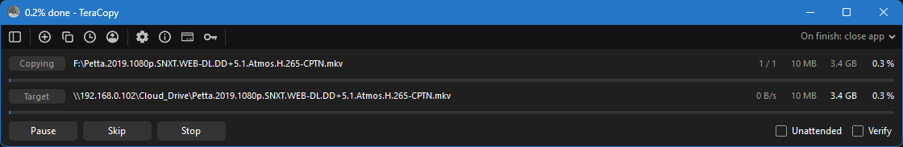

# Home Lab Server: Proxmox + CasaOS + Tailscale

Revived a dead 13-year-old desktop into a 24/7 self-hosted cloud accessible from anywhere.

## Quick Facts

- **Status:**  Operational (June 12, 2026 onwards)
- **Hardware:** Intel Pentium G3240, 12GB DDR2, 1TB WD Purple
- **Core Stack:** Proxmox VE → Ubuntu 22.04 → CasaOS → Tailscale
- **Access:** Secure VPN mesh network (no port forwarding)
- **Storage:** 500GB accessible from phone/laptop anywhere

## Full Documentation

To keep this README clean, the detailed documentation has been split into dedicated files:

-  **[Hardware Specs & Bottleneck Discovery](docs/HARDWARE_SPECS.md)**
-  **[System Architecture](docs/ARCHITECTURE.md)**
-  **[Security Architecture](docs/SECURITY.md)**
-  **[Phase-by-Phase Setup Journey](docs/SETUP_JOURNEY.md)**
-  **[Media Server Automation & Fixes](docs/MEDIA_AUTOMATION.md)**

## The Challenge

- Old desktop had dead Hikvision SSD
- Only surviving storage: 1TB surveillance drive
- Goal: Keep dual-monitor laptop setup, use old rig productively
- Solution: Make it a headless server instead

## Screenshots

### Proxmox Dashboard

### CasaOS Web Interface

### Tailscale Mesh Network

### File Transfer Working

## Current Status

### Working ✅
- Proxmox hypervisor (continuous uptime)
- Ubuntu container (2 cores, 8GB RAM, resource-efficient & crash-proof)
- CasaOS dashboard (accessible from browser)
- Samba file sharing (Windows/Linux/Android)
- Tailscale VPN (secure mesh network)
- **Immich** (Google Photos replacement & background sync)
- **Jellyfin** (Self-hosted media streaming)
- **Radarr/Sonarr + Prowlarr** (Fully automated media stack)
- **AdGuard Home** (Network-wide ad-blocking & DNS overriding)

### Planned 🚧
- External backup drive (3-2-1 backup strategy)

## Key Learnings

1. **Hypervisors maximize old hardware** - Pentium G3240 runs smoothly as infrastructure
2. **Security-first beats convenience** - Tailscale > port forwarding, always
3. **Monitoring reveals truth** - netsh/lsblk diagnostics found real bottleneck in minutes
4. **Constraints breed creativity** - Hardware limits → new architecture approach
5. **Old hardware has value** - This rig would be e-waste; now it's productive infrastructure

## Contact

- LinkedIn: [Akshar Srijan](https://www.linkedin.com/in/akshar-srijan-863339250)
- GitHub: @AksharS07

---

**Status:** Actively maintained  
**Last Updated:** June 14, 2026  
**Uptime:** Continuous since installation
